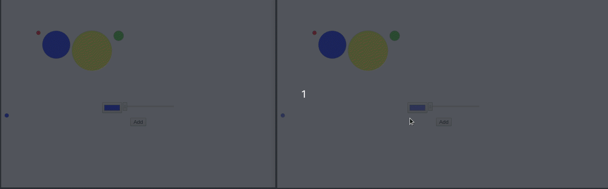
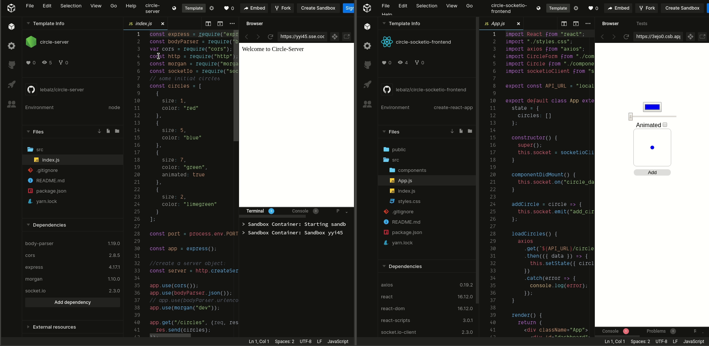

# Circle http frontend

A javascript react project using http requests for fetching data. 

Check it out on [CodeSandbox](https://codesandbox.io/s/github/lebalz/circle-http-frontend)

This should be used in combination with the [circle-server](https://github.com/lebalz/circle-server).

Instead of using a polling pattern with http requests there is a more suitable version with socket communication. Check out [here: circle-socketio-frontend](https://github.com/lebalz/circle-socketio-frontend). 




Remark that the client has to be refreshed (or add a circle itself) to get the updates from the other server.

## install

```sh
yarn install
```

## run
```sh
yarn start
```

## Codesandbox

1. Make sure to first start a [Circle-Server Sandbox](https://codesandbox.io/s/github/lebalz/circle-server).

2. Copy the URL of the *Circle-Server Sandburl shall not have a trailing slash `/`!


